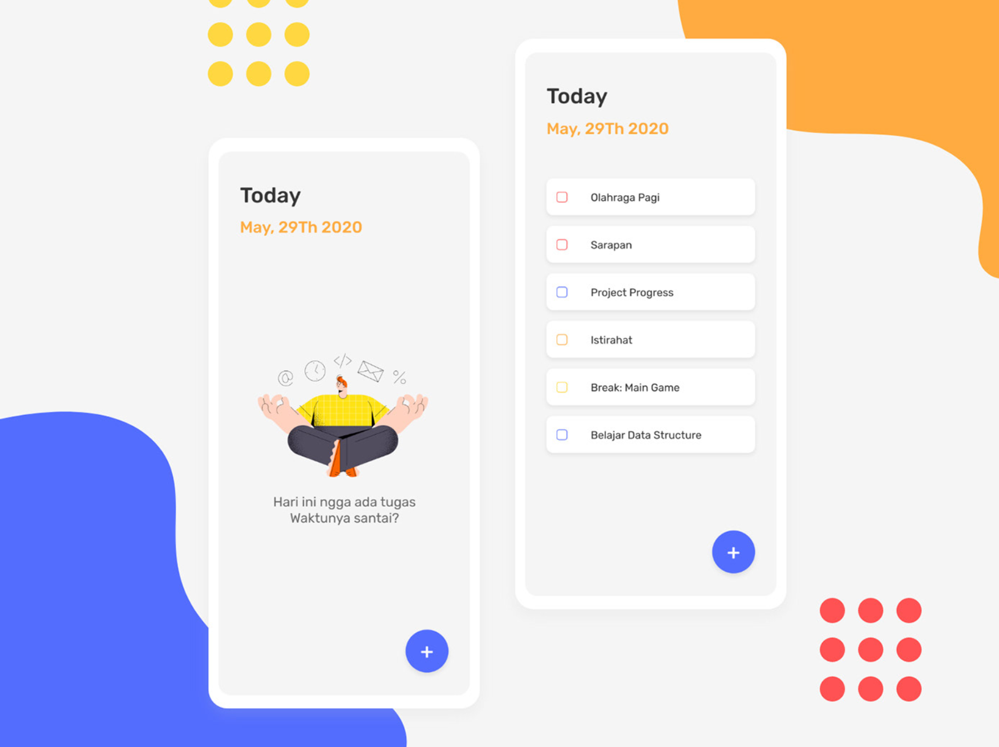
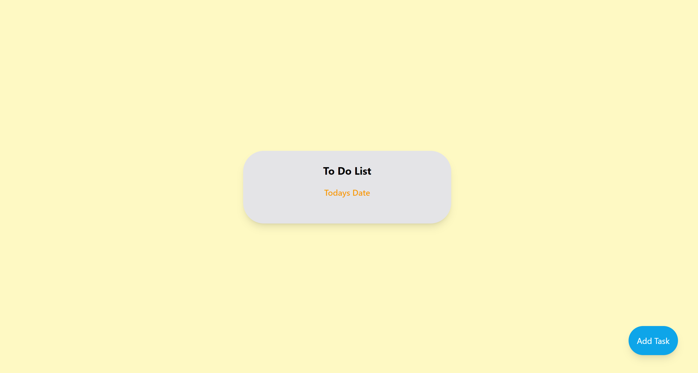
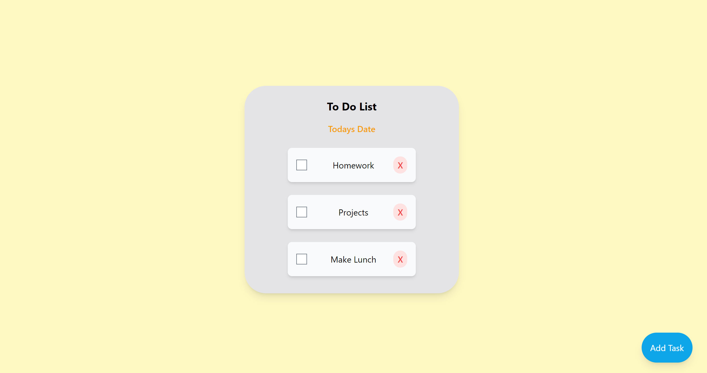
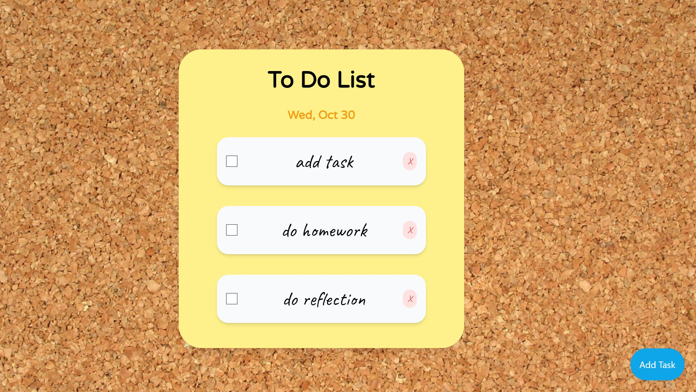

# Projects for Web Development

This is my projects for my Web Development Class. There are 2 Projects. The second one is at https://github.com/SpurSlicer/Front-End-Web-Dev-Project-2/tree/main

## Project 1

This project is a To-Do App that uses Interact.js, a new javascript library I haven't used yet. 

### Proposal

Topic: To Do List / Planner

API/ Library:  Interactjs or Draggablejs

Minimum Viable Product:  A functional , good looking to do list, can add and delete items and move around to order

Stretch Goals:  Add calendar features (momentjs?) to add dates, have a day planner to plan out many days or a whole week, feature to edit items without remaking them, 

Can use media queries to make the list responsive to different screens / accesibilities

I chose this idea because I need to better schedule my time

### Blog

My project is a to-do app, and there are many out there so I first googled to-do list app designs and ideas to get a sense of what has already been done. 
I really liked this design:

I liked how simple and easy to understand it was, and how the colors were used. 

Getting started was decently easy, I knew I wanted a title, and then the list, and then an add task button so I set up my html with these, and started with an empty list that the javascript will append to

In my javascript, I first listed out some functions I knew I wanted, like creating a task list item, adding a task, deleting a task

I just made my basic list that can add and delete items and started to mess around with tailwind css. I have never used it so it was a very slow start but I used a ton of documentation and got it to look decently how I wanted.

I then added my interact js and started by copy pasting from the documentation and filling in my ids and classes to the draggable model. It worked well for the most part, and I messed around with the inertia feature. 

I wanted my items to click into place in the list so they can be reordered so I added a dropzone using the documentation and set it to my list div. It has worked somewhat and I can reorder some, but only moving items down the list. Up hasn’t worked yet, that is this week's goal. 

So far I have stuck with the defaults for tailwind, but I want to add my own colors and typography to my design so it is more unique. I would like to also add some background designs like the inspiration I found.

I had a cool idea that instead of a delete button on each task, I could make a trash can in a corner and the items can be dragged there to be deleted. I need to look more into interact js to see how to do this.

I had a bit of trouble with dropzones, and it took me many tries to get it to work. The challenge was that I wanted to not only drop items into the list, but to append them to the correct index in the list.

This is my design so far:

### Screenshots

### Reflection
Overall, I am decently happy with this project. I think it is a good small project I can add to a portfolio. 

Feedback I got was to add some ui/ux experience when a task gets done , like confetti, and I like this idea and would like to experiment more with animations in css.
Another idea was to simply add more styling, so I added a corkboard background to add to my "sticky note" asthetic.
I also need to polish and get my dropzones to fully work, and possibly add other lists for completed tasks, etc.
Someone said I could add colors to the task items, so that they can be organized or grouped better and and add more customization.

I attacked this project by first finding a base library I wanted to use. Then I looked at the library and made a small list of ideas it could be used for. I decided on an interactable to do list because it is a good portfolio project and pretty basic to learn a new library. Since my idea was basic, I added tailwindcss, so I could learn and study that as well. 

I did hit my minimum viable goal, but not much of my stretch goals. The first week I spent a bunch of time figuring out tailwind and making a basic javascript to do list I can add and delete items from. The next week I added interactjs functions, and this took a few tries to get working. I was trying to use a shortcut for my draggable and it made it not functiom correctly at all, but I put in the actual full documentation flow by wrapping it with a listener and it worked perfectly. The dropzone gave me the most trouble as all of the documentation was just about simply dropping to an area and adding styles. Mine needed to read the child contents of the list and reorder the indexes when I dropped an item. This turned out to be a much harder task than I thought. 

New tools I used were interactjs, tailwindcss, vite, and I better understood how to use Node.js!
